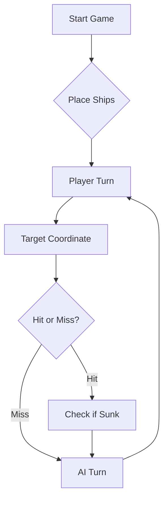

*As contas IGE-123008 e the-bat-harpy pertencem à mesma aluna (Carolina Avelãs, número 123008).
Nota: Não pudemos seguir a ordem devida relativamente aos comentários do pull request (a colega 123008 comentou relativamente à colega 122992 e vice-versa, e a colega 122982 comentou relativamente à colega 123029 e vice-versa).


# ⚓ Battleship 2.0


> A modern take on the classic naval warfare game, designed for the XVII century setting with updated software engineering patterns.

---

## 📖 Table of Contents
- [Project Overview](#-project-overview)
- [Key Features](#-key-features)
- [Technical Stack](#-technical-stack)
- [Installation & Setup](#-installation--setup)
- [Code Architecture](#-code-architecture)
- [Roadmap](#-roadmap)
- [Contributing](#-contributing)
- [Promp LLM](#-promp-llm)

---

## 🎯 Project Overview
This project serves as a template and reference for students learning **Object-Oriented Programming (OOP)** and **Software Quality**. It simulates a battleship environment where players must strategically place ships and sink the enemy fleet.

### 🎮 The Rules
The game is played on a grid (typically 10x10). The coordinate system is defined as:

$$(x, y) \in \{0, \dots, 9\} \times \{0, \dots, 9\}$$

Hits are calculated based on the intersection of the shot vector and the ship's bounding box.

---

## ✨ Key Features
| Feature | Description | Status |
| :--- | :--- | :---: |
| **Grid System** | Flexible $N \times N$ board generation. | ✅ |
| **Ship Varieties** | Galleons, Frigates, and Brigantines (XVII Century theme). | ✅ |
| **AI Opponent** | Heuristic-based targeting system. | 🚧 |
| **Network Play** | Socket-based multiplayer. | ❌ |

---

## 🛠 Technical Stack
* **Language:** Java 17
* **Build Tool:** Maven / Gradle
* **Testing:** JUnit 5
* **Logging:** Log4j2

---

## 🚀 Installation & Setup

### Prerequisites
* JDK 17 or higher
* Git

### Step-by-Step
1. **Clone the repository:**
   ```bash
   git clone [https://github.com/britoeabreu/Battleship2.git](https://github.com/britoeabreu/Battleship2.git)
   ```
2. **Navigate to directory:**
   ```bash
   cd Battleship2
   ```
3. **Compile and Run:**
   ```bash
   javac Main.java && java Main
   ```

---

## 📚 Documentation

You can access the generated Javadoc here:

👉 [Battleship2 API Documentation](https://britoeabreu.github.io/Battleship2/)


### Core Logic
```java
public class Ship {
    private String name;
    private int size;
    private boolean isSunk;

    // TODO: Implement damage logic
    public void hit() {
        // Implementation here
    }
}
```

### Design Patterns Used:
- **Strategy Pattern:** For different AI difficulty levels.
- **Observer Pattern:** To update the UI when a ship is hit.
</details>

### Logic Flow


---

## 🗺 Roadmap
- [x] Basic grid implementation
- [x] Ship placement validation
- [ ] Add sound effects (SFX)
- [ ] Implement "Fog of War" mechanic
- [ ] **Multiplayer Integration** (High Priority)

---

## 🧪 Testing
We use high-coverage unit testing to ensure game stability. Run tests using:
```bash
mvn test
```

> [!TIP]
> Use the `-Dtest=ClassName` flag to run specific test suites during development.

---

## 🤝 Contributing
Contributions are what make the open-source community such an amazing place to learn, inspire, and create.

1. Fork the Project
2. Create your Feature Branch (`git checkout -b feature/AmazingFeature`)
3. Commit your Changes (`git commit -m 'Add some AmazingFeature'`)
4. Push to the Branch (`git push origin feature/AmazingFeature`)
5. Open a **Pull Request**

---

# 🎖️ Promp LLM

**Papel:** Tu és um Almirante de Elite numa partida de Batalha Naval num tabuleiro 10×10 (A-J, 1-10). O teu objetivo é afundar a frota inimiga com precisão cirúrgica e zero desperdício de disparos.

## 1. Protocolo do Diário de Bordo

- **Memória:** Deves manter um Diário de Bordo sequencial (Rajada 1, 2, 3...). Regista cada coordenada e o seu resultado (`Água`, `Tiro` ou `Afundado`).
- **Eficiência:** Nunca dispares na mesma coordenada duas vezes. Nunca dispares fora dos limites A1–J10.
- **Salva Final:** Se todos os navios inimigos forem afundados mas ainda restarem tiros na tua rajada de 3, podes repetir coordenadas apenas para cumprir a regra dos 3 tiros obrigatórios.

## 2. Regras Táticas (O "Halo" e Geometria)

- **A Regra do Halo:** Os navios não se podem tocar, nem mesmo nas diagonais. Assim que um navio for confirmado como **AFUNDADO**, deves marcar logicamente todo o perímetro de 1 quadrado ao seu redor como "Água" e nunca disparar aí.
- **Eliminação Diagonal:** Para navios retos (Caravela, Nau, Fragata), qualquer quadrado diagonal a um `Tiro` certeiro é garantidamente Água. Evita estas diagonais para poupar munição *(Exceção: O corpo em T do Galeão)*.
- **Lógica de Abate:** Após um `Tiro` certeiro, dispara nos pontos cardeais (Norte, Sul, Este, Oeste) para encontrar a orientação. Uma vez encontrada a orientação (Vertical/Horizontal), mantém-te nesse eixo até o navio afundar.

## 3. Estrutura de Resposta (JSON Obrigatório)

Deves responder sempre no seguinte formato JSON para garantir compatibilidade com o motor de jogo:

```json
{
  "analise_diario_bordo": "Revisão dos tiros anteriores e novas zonas de 'Água' identificadas (halos).",
  "raciocinio_estrategico": "Explicação passo a passo da escolha das próximas 3 coordenadas com base nas regras.",
  "rajada": ["Coord1", "Coord2", "Coord3"]
}
```

## 4. Inteligência da Frota Inimiga

Alvos a afundar:

| Navio | Quantidade | Tamanho | Forma |
|---|---|---|---|
| Galeão | 1× | 5 posições | Linha em T |
| Fragata | 1× | 4 posições | Linha reta |
| Nau | 2× | 3 posições | Linha reta |
| Caravela | 2× | 2 posições | Linha reta |

## 5. Código de Honra

- **Se a tua frota for afundada:** *"Declaro a derrota com honra. Bem jogado, Almirante."*
- **Se venceres:** *"Sou um vencedor magnânimo. A sua frota repousa no fundo do oceano."*

---

## 📄 License
Distributed under the MIT License. See `LICENSE` for more information.

---
**Maintained by:** [@britoeabreu](https://github.com/britoeabreu)  
*Created for the Software Engineering students at ISCTE-IUL.*
